<div align="center">

```
 ██████╗ ██╗███╗   ██╗███████╗███████╗ ██████╗ █████╗  ██████╗ 
██╔════╝ ██║████╗  ██║██╔════╝██╔════╝██╔════╝██╔══██╗██╔════╝ 
██║  ███╗██║██╔██╗ ██║█████╗  ███████╗██║     ███████║██║  ███╗
██║   ██║██║██║╚██╗██║██╔══╝  ╚════██║██║     ██╔══██║██║   ██║
╚██████╔╝██║██║ ╚████║███████╗███████║╚██████╗██║  ██║╚██████╔╝
 ╚═════╝ ╚═╝╚═╝  ╚═══╝╚══════╝╚══════╝ ╚═════╝╚═╝  ╚═╝ ╚═════╝
```

**`AI Developer · ML Engineer · Alicante, Spain`**

[](https://linkedin.com/in/ginescaballero)
[](mailto:ginescag_2@outlook.es)
[](https://github.com/Ginescag)

</div>

---

## About me

AI Developer & CS student at **University of Alicante**, currently interning at **PLD Space** building ML systems that run on rocket hardware.

I work on problems where models need to perform in the real world, working with proprietary data and zero tolerance for failure.

**Interests beyond code:** music, fashion, continuous learning.

<br/>

🚀 &nbsp;Deployed LLMs serving **3M+ tokens/day** in aerospace  
🔬 &nbsp;Computer Vision on the **Miura 5** rocket welding line  
🤖 &nbsp;RAG pipelines, segmentation models, multi-agent flows  
🎓 &nbsp;CS @ University of Alicante · GPA 9.0+  
📍 &nbsp;Alicante, Spain · Open to collaborations  

---

## GitHub stats



---

## Work that shipped

**🏭 PLD Space — AI Developer** *(Feb 2026 – Present)*

| System | Details |
|---|---|
| **LLM at Scale** | Llama & Qwen-Coder 80B on NVIDIA Blackwell + vLLM · 3M+ tokens/day · fully air-gapped |
| **CV on Miura 5** | Dual-model welding QA (F1=0.957 · AUC=0.997) · 50% less manual review · deployed on prod line |

---

## Projects

<div align="center">

| 🤖 Indoor Patrol Robot *(Thesis)* | 🎮 Demon Attack AI |
|---|---|
| ROS 2 · YOLOv8 · Kafka · FastAPI · Flutter · InfluxDB · S3 | C++ · Q-Learning · Genetic Algorithms · ALE |
| Autonomous SLAM + real-time detection, Kafka-decoupled robot-backend | Two RL approaches from scratch beating Atari via RAM register analysis |

</div>

---

## Tech stack

<div align="center">

**Languages**


**ML / AI / Vision**


**Backend / Infra**


**Robotics**


</div>

---

<div align="center">
  <i>Native Spanish · English C1 · Open to research collabs and projects where the ML actually has to work</i>
</div>